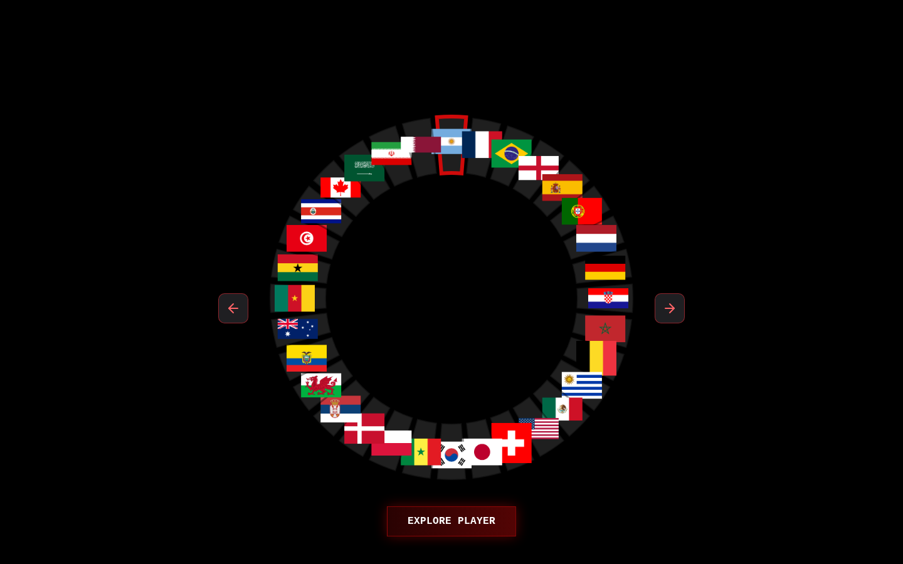
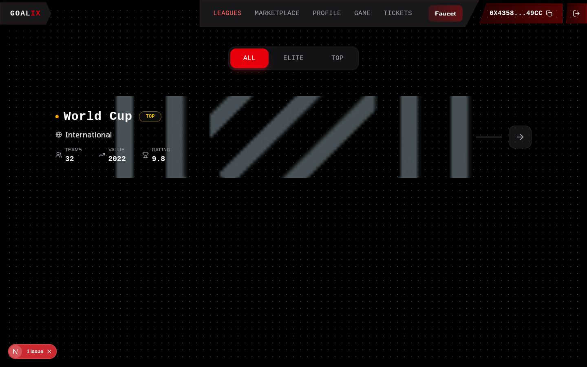
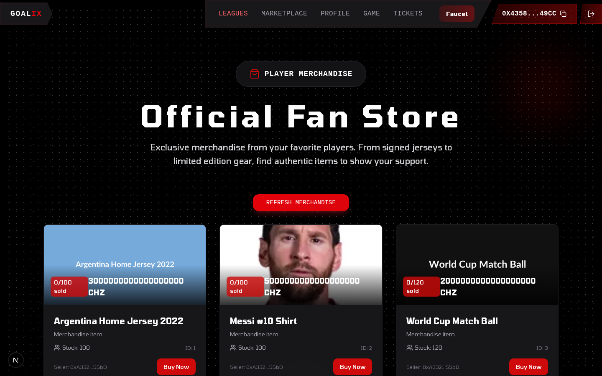
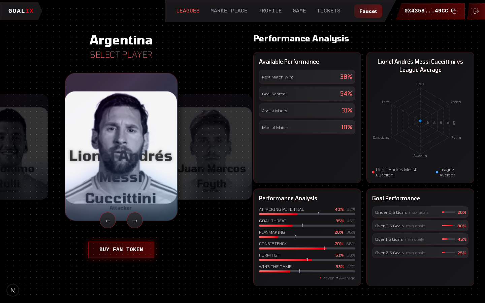
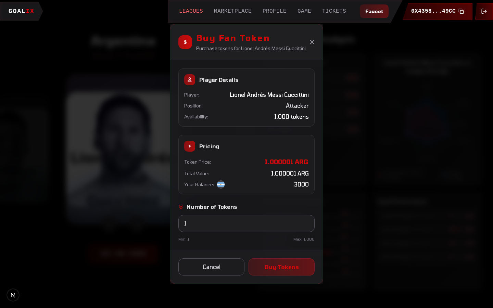
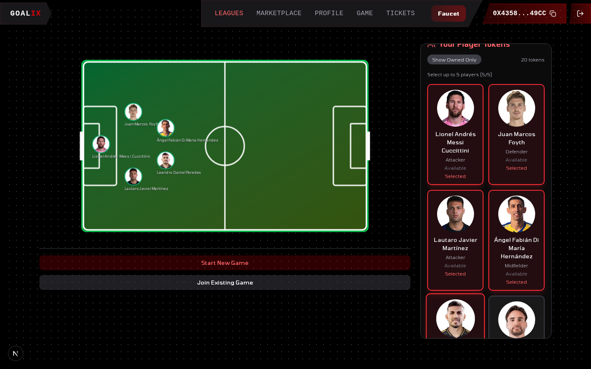
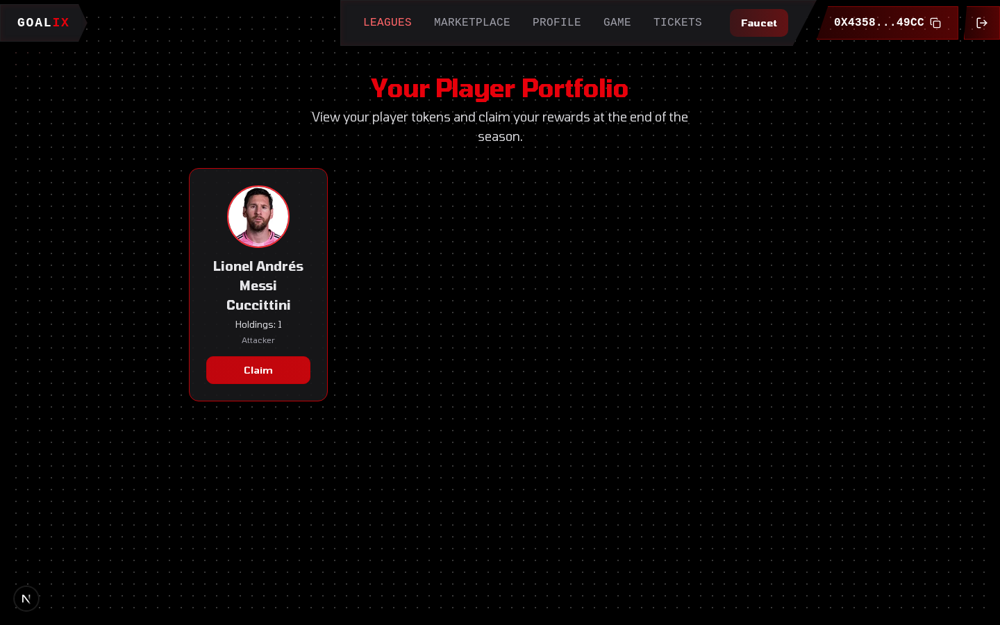

# Goalix

### Performance-driven fan engagement, built on X Layer.

## Demo & Pitch Video

[](https://drive.google.com/file/d/1Ei6cAVmN2GUgLHiS3Gd17AUbJtd6qaxX/view?usp=drivesdk)

> Fan tokens today reward fame. Goalix rewards **form**. We turn the billions of fleeting interactions around a World Cup into persistent, on-chain participation — one player, one match, one tap at a time.

Built for the **X Cup Hackathon** (X Layer · May 19–28). World Cup theme. Live on X Layer testnet.



---

## The problem

The fan-token economy is mispriced. Tokens are minted at the **club or league** level, but fandom lives at the **player** and **tournament** level. Worse, they never expire and never reprice — a token keeps trading the same whether the player is scoring in a final or sitting injured on the bench.

So the world's largest recurring event generates billions of interactions, and almost **none** of it becomes on-chain activity. The hype cycle spikes, then evaporates.

## The solution

**Goalix tokenizes players as expiring, performance-priced ERC-20s — Player Fan Tokens (PFTs).**

- **Performance-priced.** Every player is its own token whose price moves on a bonding curve scaled by an on-chain performance score (goals, assists, duels, cards — weighted by position). Form is the market.
- **Ecosystem-backed.** PFTs are minted and paid for in a **team fan token**, not raw gas — keeping value inside the ecosystem.
- **Expiring.** Seasons end. At expiry, holders burn their tokens to claim a pro-rata share of the token's payment pool; the player keeps a reserved cut. Healthy economies, no zombie tokens.
- **Useful.** PFTs unlock head-to-head PvP games, match tickets, merch, and end-of-season rewards.

The result is a **sports-to-on-chain acquisition funnel**: watch the match → back the player → trade, play, and claim — repeat every tournament.

---

## What's live right now (X Layer testnet · chainId `1952`)

This isn't a deck. The full loop runs on-chain today.

| Capability | Status |
|---|---|
| Connect with **Privy** (email / social / wallet, embedded, gasless UX) | ✅ Live |
| **Faucet** — mint the Argentina (ARG) fan token | ✅ On-chain |
| **Buy a player token** — approve ARG → bonding-curve `purchaseTokens` | ✅ On-chain |
| **Portfolio** — holdings reflected from chain | ✅ On-chain |
| **PvP game** — stake 5 players, winner by real performance scores | ✅ On-chain |
| **Season claim** — burn tokens, claim payment-pool share | ✅ On-chain |
| **Marketplace** — player merchandise | ✅ On-chain |
| **Performance oracle** — API-Football → on-chain stats | ✅ Wired |

**Scope for the hackathon:** one league — the **World Cup (2022)** — and one squad: **Argentina**, the champions. Messi, Di María, Lautaro, Emiliano Martínez and 16 more are each a tradeable, performance-priced token.

### Screenshots

| Leagues | Marketplace |
|---|---|
|  |  |
| **Player & performance analysis** | **Buy a Player Fan Token** |
|  |  |
| **PvP game — stake 5 players** | **Portfolio & season claim** |
|  |  |

### Deployed contracts

| Contract | Address |
|---|---|
| Argentina Fan Token (`ARG`) | `0x45b2bAeD94107fBa50EE4832BC8820470D535E53` |
| Game (`GameContractMultiToken`) | `0xC7507E781eE5ef001e6fDe7B25F0702Bdf5854C1` |
| Ticketing | `0x02a4AF3E8b6Cb63A661D46eBCcE5C03ec98c30C7` |
| Merch (`MerchNFT`) | `0x7EBe0903D6DdF8588DceB956F171F5869988a0D7` |

**Player Fan Tokens** — 20 Argentina WC-2022 squad PFTs (full set in `contracts/enhanced-player-data-1-2022.json`):

| Player | Symbol | Pos | Token address |
|---|---|---|---|
| Lionel Messi | `LCUC` | ATT | `0xE48EFbF7BD7136C7a4EFDFeBaAE8F8838bB221AB` |
| Lautaro Martínez | `LMAR` | ATT | `0x83B0b475c992f776641650C0E9130aA2067C4D79` |
| Ángel Di María | `ÁHER` | MID | `0xfE5E70d1f86e4cf949966C8A5AADDF2B4fef4Aa0` |
| Leandro Paredes | `LPAR` | MID | `0xC94aD020235a74a9Fd399a6dC119b2bc5D33b436` |
| Nicolás Otamendi | `NOTA` | DEF | `0xFDA7685eFEeFB46e7Da5d6353fecC766C5E9Ace2` |
| Nicolás Tagliafico | `NTAG` | DEF | `0x1f2fBeFb1aD6b974172e137731E4F4A539F0b739` |
| Marcos Acuña | `MACU` | DEF | `0x568F621D33A832914Bd8625b4a2b4bEE0AEA36Ec` |
| Juan Foyth | `JFOY` | DEF | `0xc80002184B6Ed8c12c0f3b5943b6B12D03352B40` |

- **Network:** X Layer testnet · chainId `1952` · native token OKB
- **RPC:** `https://testrpc.xlayer.tech` · **Explorer:** [OKLink](https://www.oklink.com/xlayer-test)

---

## How it works

```
Watch the match
   │
   ▼
Connect (Privy embedded wallet)
   │
   ▼
Faucet  ──►  ARG fan token
   │
   ▼
Buy Player Fan Token   (approve ARG → purchaseTokens on a performance bonding curve)
   │
   ├─►  PvP Game     (stake 5 players; on-chain calculatePerformance decides the winner)
   ├─►  Tickets / Merch
   └─►  Season Claim (burn → pro-rata share of the payment pool)
                       ▲
   API-Football ──► Oracle ──► on-chain player stats ──► repricing
```

A player's on-chain `calculatePerformance(position)` derives a 1–10 score from real stats and drives **both** the token price and game outcomes — so the market and the gameplay track the pitch.

---

## Tokenomics

A three-tier asset stack keeps value inside the X Layer ecosystem:

```
OKB  (X Layer native — gas)
  └─► Team Fan Token        e.g. ARG  (ERC-20, 18 decimals)   ← minting currency
        └─► Player Fan Token  e.g. LCUC (ERC-20, 0 decimals)  ← performance-priced, expiring
```

- **Player Fan Token (PFT):** one ERC-20 contract per player, **0 decimals** (whole-unit tokens). A fixed initial supply is minted to the contract itself and sold from reserve along a bonding curve. The **payment currency is the team fan token** (ARG), never raw gas.
- **Team Fan Token (ARG):** the ecosystem currency for a squad; used to mint/buy PFTs, faucet-minted on testnet.
- **Season pool split:** every PFT accumulates an ARG pool from purchases. At season end the split is **20% reserved for the player**, **80% distributed pro-rata to holders** on claim.

## Token price formula

Price is a **performance-weighted bonding curve** — demand *and* on-chain form move it. Per token:

```
unitPrice = basePrice × perfFactor × ( 1 + demand / (reserve + 1) )

  basePrice  = 1e18                       (1.0 ARG, base)
  perfFactor = performance / 10           (performance ∈ 1..10  →  0.1 .. 1.0)
  reserve    = tokens still held by the contract        (supply not yet sold)
  demand     = tokens already sold        (totalSupply − reserve)
```

Buying `n` tokens integrates the curve: `reserve` decreases and `demand` increases by 1 per token, so each successive token costs slightly more (`calculateTotalPrice(n)`).

**`performance` (1–10)** is computed fully on-chain from real match stats, weighted by position (`calculatePerformance`):

| Position | Scoring weights |
|---|---|
| Attacker | `5·goals + 3·assists + 2·shotsOnTarget + 1·duelsWon` |
| Midfielder | `3·goals + 4·assists + 1·duelsWon` |
| Defender | `4·tackles + 2·duelsWon − 2·(yellow + red cards)` |
| Goalkeeper | `100 − (yellow + 2·red)·10` |

…each capped to 100 and scaled to a 1–10 score. **The same score that prices the token also decides who wins a PvP game** — so the market and the gameplay both track the pitch.

## Token lifecycle

```
MINT        Player token deployed → initialSupply minted to the contract
  │
TRADE       purchaseTokens()  — buy from reserve on the performance curve (pay ARG)
  │         (oracle reprices as match stats update)
  │
SEASON END  endSeason()  — locks the token, reserves 20% of the ARG pool for the player
  │
CLAIM       claim()       — holders burn PFTs for an 80% pro-rata share of the pool
  │         playerClaim() — the player withdraws their reserved 20%
  │
LEGACY      expired token → commemorative / collectible mode; next season mints fresh PFTs
```

This makes tokens **time-bound and self-settling** — no perpetual zombie tokens; each tournament starts a clean, fairly-priced market.

## Trading & OKX (roadmap)

Today, the **primary market** is the in-contract bonding curve (`purchaseTokens` / season `claim`) — no external liquidity needed to launch.

Because X Layer is **OKX's chain**, the natural next step is to route all secondary trading through **OKX DEX / Onchain OS**:

- **Secondary swaps** for PFTs and fan tokens via the OKX DEX aggregator — `OKB ↔ ARG ↔ PFT` routing with deep, shared liquidity instead of isolated curves.
- **Seed liquidity pools** (ARG/PFT) so fans can exit positions instantly at market price, not just along the curve.
- **Fiat on/off-ramp** through the OKX exchange — a football fan funds a wallet and buys a player token in one flow.
- **Cross-pairing & discovery** — surface trending player tokens inside OKX's trading and market surfaces during live tournaments.

OKX becomes the liquidity + distribution layer; Goalix supplies the performance-priced assets and the fan demand.

## Architecture

Monorepo, two packages:

- **`contracts/`** — Hardhat + Solidity 0.8.20. `PlayerToken` (one ERC-20 per player, 0 decimals, bonding curve, season/claim lifecycle), `FanToken` (team currency), `GameContractMultiToken` (head-to-head), `Ticketing`, `Merch`, plus the API-Football adapter and the stats oracle/cron.
- **`web/`** — Next.js 15 (App Router, React 19), wagmi/viem on a custom X Layer chain, **Privy** for embedded-wallet auth, Tailwind v4 + shadcn/ui. Server routes proxy API-Football and IPFS to keep keys server-side.

Player stats flow from **API-Football** through an oracle that diffs and pushes only changed stats on-chain.

## Tech stack

`X Layer` · `Solidity 0.8.20` · `Hardhat` · `Next.js 15 / React 19` · `viem` · `wagmi` · `Privy` · `Tailwind v4` · `shadcn/ui` · `API-Football`

---

## Getting started

**Contracts** (`contracts/`)
```bash
npm install
npx hardhat compile
npx hardhat test
# deploy to X Layer (needs PRIVATE_KEY in contracts/.env)
npm run deploy-team-tokens
TEAM_ID=26 npm run deploy-all      # Argentina squad
```

**Web** (`web/`)
```bash
bun install        # or npm install
bun run dev        # http://localhost:3000
bun run build && bun run start   # production
```

Env: `web/.env.local` needs `NEXT_PUBLIC_PRIVY_APP_ID` + `API_FOOTBALL_KEY`. `contracts/.env` needs `PRIVATE_KEY`, `API_FOOTBALL_KEY`, `RPC_URL`.

See [`CLAUDE.md`](./CLAUDE.md) for the full architecture and gotchas.

---

## Demo

A 1–3 min walkthrough (connect → leagues → buy a player → portfolio → marketplace → play a game, all via the Privy wallet) is recorded on the `walkthrough-video` branch (`tmp/walkthrough.mp4`).

---

## Why this wins traffic

The World Cup is the single largest recurring attention event on earth, and fandom is already **performance-obsessed** — fans track stats daily, spend on merch, play fantasy, and argue online. Goalix doesn't ask fans to learn DeFi; it gives them a sharper version of what they already do, with a wallet attached. Every viral moment becomes a mint, a trade, a game — and a new on-chain user for X Layer.

## Roadmap

- More squads and live tournaments (multi-team, multi-league)
- Real-time match-day repricing via the oracle
- Prediction markets and fantasy integrations
- Staking yields and legacy/retired-player NFTs
- Mainnet on X Layer

---

## Vision

Goalix aims to be **the** sports-engagement protocol on X Layer — performance-driven, utility-backed, community-owned, and tournament-aware. We turn every major football moment into an on-chain growth engine.

*Back form, not fame.*
